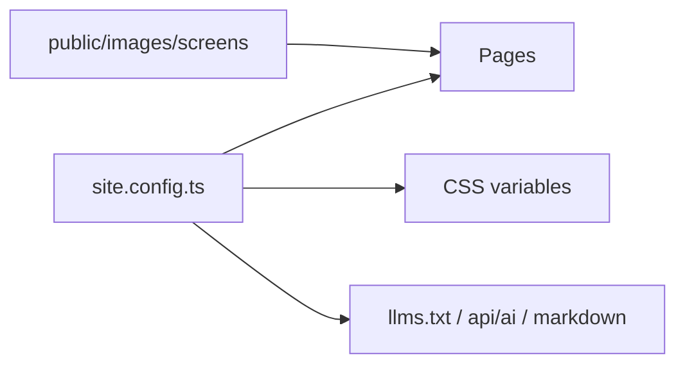

# Design

The template is copied into a child repo, usually as `site/`. It does not
become a runtime dependency of the product.

Story shape, from Indulge: hero with one phone, tension, screenshot
chapters, fit, privacy, FAQ, founder note, closing. Atmosphere uses
token-colored lanterns, not Indulge’s room furniture.

`PUBLIC_TESTFLIGHT_URL` is the only build-time secret. Without a verified
`testflight.apple.com` URL the CTA points at `/testflight/`.
