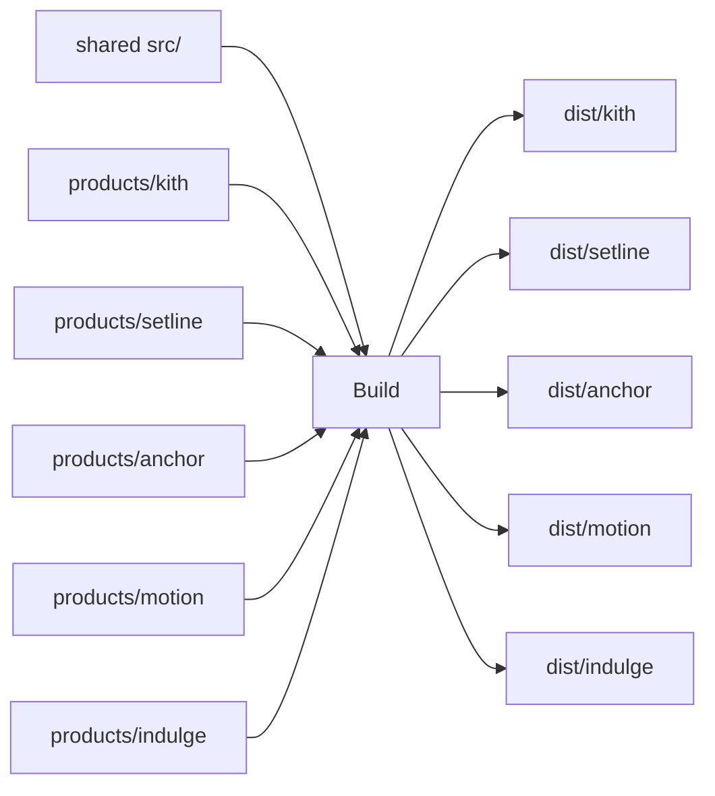

# Design

One codebase, five static sites.

`PRODUCT` selects `products/<id>/site.config.ts` and
`products/<id>/public`. `astro.config.mjs` sets `site`, `publicDir`, and
`outDir` to `dist/<id>`.

Product domains stay on the product catalog rows. This repo does not
take ownership of `*.significanthobbies.com`.

The copyable template at `foundry/ops/templates/ios-landing` remains for
a new standalone iOS app. The five current apps use this factory.
