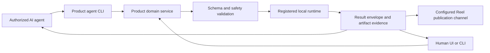

## Context

Reel Pipeline already has registries and a versioned execution envelope. Mashup
has a broad Typer CLI and resumable SQLite-backed stages. Studio has strict
graphs and render actors, but orchestration is coupled to `StudioViewModel`.
The products use different languages and must remain independently runnable.

## Goals / Non-Goals

**Goals:**

- Give agents complete, testable discovery and operation coverage.
- Keep human and agent surfaces on the same domain logic.
- Make JSON stdout stable enough for any local agent runtime.
- Preserve local-only media, approval, rights, path, and arbitrary-code guards.
- Add no production dependency and require no always-on daemon.

**Non-Goals:**

- A universal natural-language agent inside each product.
- Cloud rendering, collaboration, or unconfigured remote media upload.
- Direct MCP implementations before the underlying operation contract is stable.
- Claiming unsupported product ambitions as callable capabilities.

## Decisions

### Use a shared contract, not a shared runtime package

Each product implements `fleet.video-agent-operation.v1` natively in Swift,
Python, or JavaScript. Canonical JSON fixtures and conformance cases live with
the OpenSpec change and are copied into each product's tests as needed.

This avoids a cross-language production dependency while preventing semantic
drift. A shared executable or network daemon was rejected because it would add
deployment, lifecycle, and failure coupling.

### Start with non-interactive CLIs

The first transport is one JSON request/result per invocation, with JSONL event
mode for long work where the product can report progress. CLI transport works
with Codex, Devin, Claude, shell-capable local agents, and future MCP servers.

MCP-first was rejected because it would duplicate orchestration before domain
services exist and would not improve the underlying completeness contract.

### Separate operation protocol from product manifests

The envelope standardizes lifecycle and evidence. Each product manifest owns
its actual operations and schemas. Completeness tests join manifests against
the authoritative registry: effects for Studio, adapters/variants for Reel,
and supported editorial commands/stages for Mashup.

### Extract Studio orchestration before exposing its CLI

Studio gains a `StudioDomainService` that owns import/analyze, planning,
validation, editing, estimation, rendering, persistence, and export. SwiftUI
and a new `studio-agent` executable both call it. The CLI never instantiates a
window or manipulates `StudioViewModel`.

### Use durable operation identities only where work is durable

Read and validation operations return immediate envelopes. Render and expensive
editorial operations receive operation IDs and persisted result metadata.
Cancellation is supported where the current runtime is cancellation-aware.
No fake background durability is claimed for a process that cannot survive exit.

### Keep invocation bounded

Operation names are enums/registries. Inputs are strictly decoded. Local paths
pass existing approved-root or project-source rules. No operation accepts a
command, script, plugin path, or code body. Diagnostics go to stderr; stdout is
reserved for protocol output.

### Keep publication in Reel Pipeline behind channel policy

Studio and Mashup emit validated local artifacts and receipts. Reel Pipeline
owns channel packaging and calls only existing configured distribution
adapters. Each channel publishes a capability manifest and one of three policy
modes: `draft_only`, `approval_required`, or `autonomous`. An autonomous policy
is explicit operator configuration, not something an LLM may infer. Every
external write records an idempotency key and provider receipt.

Putting publication into all three products was rejected because it would
duplicate credentials, policy, platform constraints, and remote-write logic.

## Risks / Trade-offs

- **Contract breadth becomes superficial** → Require registry-to-manifest
  completeness tests and executable conformance scenarios.
- **Studio extraction regresses SwiftUI state** → Move behavior incrementally
  and keep existing ViewModel tests/build checks while adding service tests.
- **Long operations outlive CLI expectations** → State exactly whether an
  operation is foreground, cancellable, or resumable; never imply daemon
  durability.
- **Three implementations drift** → Use one schema version, shared golden
  fixtures, stable error taxonomy, and per-product conformance commands.
- **“10/10” encourages unsafe universality** → Score only supported registered
  capabilities; unsupported ambitions remain explicit manifest gaps, not
  hidden arbitrary execution.

## Migration Plan

1. Land the protocol fixtures and conformance vocabulary in Fleet.
2. Implement Reel discovery/validation first over existing registries.
3. Implement Mashup JSON wrapping over existing commands and stage state.
4. Extract Studio domain orchestration and add its CLI.
5. Add configured-channel packaging/publication operations to Reel Pipeline.
6. Run cross-product manifest completeness and negative safety tests.
7. Update agent instructions, READMEs, status files, and issue links.
8. Preserve all existing human commands during migration; rollback is removal
   of the new CLI entrypoints without changing stored projects or receipts.
