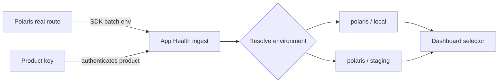

## Context

App Health currently authenticates an ingest key to one `(app_id, environment_id)` pair. The SDKs already expose product and environment configuration, but the JSON batch does not carry environment. Polaris PR #282 therefore embeds a staging-only key and cannot use that identity for a local lane.

The desired operator model is one product named `polaris`, one revocable product key, and environment-separated telemetry selected by the client. App Health must preserve its aggregate-only privacy boundary and must not let a client use a product key to write into another product.

## Goals / Non-Goals

**Goals:**

- Issue and verify a key scoped to one product.
- Route each accepted SDK batch or OTLP resource to an explicit environment under that product.
- Let a new bounded environment appear from valid telemetry without issuing another key.
- Keep environment metrics, inventory, failures, dedupe, and installation state isolated.
- Let the dashboard switch between environments for one product.
- Preserve existing environment-scoped keys during migration.
- Prove Polaris with its normal startup and an existing route.

**Non-Goals:**

- Capturing any additional request, span, identity, URL, header, body, log, or stack data.
- Adding an OTel Collector, sidecar, agent, port, or Polaris infrastructure setting.
- Sending production Polaris telemetry as part of the initial staging/local proof.
- Adding a demo-only Polaris route.

## Decisions

### Keep key authentication product-scoped and environment routing explicit

New key records bind to `app_id` and have no fixed `environment_id`. Existing records retain their environment binding. Raw keys remain one-time values and D1 stores only their verifier.

Environment is not inferred from hostnames, endpoints, key names, or deployment URLs:

- App Health SDK batches carry a top-level `environment` string.
- OTLP resource spans carry the standard `deployment.environment.name` string.

Using the standard OTel resource attribute keeps Polaris compatible with normal OTel exporters and Collectors. A custom HTTP header was rejected because it is less portable and can disagree with resource identity.

### Resolve environments beneath the authenticated product

After key verification and payload validation, App Health resolves the normalized environment name only within the authenticated `app_id`. A missing environment is created transactionally on first accepted traffic, subject to a strict label contract and a small per-product bound. A conflicting product can never be selected from payload data.

Environment names are trimmed, lower-case slugs up to 64 characters. The initial supported Polaris values are `local`, `staging`, and `production`; the contract remains generic for other products.

### Preserve environment-key compatibility

Existing environment-scoped keys remain valid during migration:

- An old SDK batch may omit environment and remains pinned to the key's environment.
- If it supplies environment, the normalized value must match the key's environment.
- OTLP sent with an old key follows the same match-or-reject rule.

This permits App Health to deploy first and Polaris to switch keys later without an outage.

### Group OTLP by resource environment

The OTLP projector reads `deployment.environment.name` alongside the already allowlisted `service.version`. It returns privacy-bounded endpoint events grouped by environment. A product-scoped key may accept multiple resource groups in one export, but every eligible group must declare a valid environment. All other resource attributes remain ignored and unpersisted.

### Keep the dashboard product-first

The operator selects a product, then an environment belonging to that product. The selected environment ID continues to scope all existing query APIs, so the data-plane query and storage model does not broaden.

### Configure the Polaris SDK from its existing runtime environment

Polaris uses the released Echo v5 App Health installer rather than owning exporter, batching, privacy, retry, or shutdown code. The installer receives the product name, product key, and environment. Staging derives `staging` from the existing `APP_ENV`; a local run maps `development` to `local`. The product key and ingest endpoint can remain embedded for the current pilot, while production export stays disabled.

### Verify only through real application behavior

The integration proof starts Polaris normally with its existing local dependencies and calls an existing route such as `/health`. Test-only route registration and startup bypasses are prohibited for the acceptance proof.

## Risks / Trade-offs

- **A typo can create an unwanted environment** → Normalize labels, cap environments per product, and expose owner-controlled cleanup separately.
- **A leaked product key can pollute multiple environments** → Keep keys ingest-only, bound environment creation, retain revocation, and isolate the key to one product.
- **Mixed-environment OTLP exports increase projection complexity** → Group at the resource-span boundary and reject only invalid resource groups with protocol-valid partial success.
- **Changing key records can break deployed clients** → Use an additive nullable scope, keep old keys valid, and rotate only after dual-path tests pass.
- **Local Polaris startup depends on real local services** → Report missing dependencies as a local-environment blocker; do not replace them with dummy routes.

## Migration Plan

1. Add product-key and environment-resolution contracts plus dual-scope tests.
2. Apply an additive D1 migration that permits product-scoped keys and enforces unique environment names per product.
3. Deploy backward-compatible App Health ingest and dashboard behavior.
4. Issue one Polaris product key.
5. Update the Polaris SDK installer configuration and keep production disabled.
6. Run Polaris normally, call an existing local route, and verify `polaris / local`.
7. Deploy the Polaris staging change and verify `polaris / staging`.
8. Revoke the superseded staging environment key after the product-key path is proven.

Rollback keeps the existing environment key valid until step 8. Polaris can revert to that key without reverting the App Health migration.

## Open Questions

- Whether the owner dashboard should support renaming/deleting typo environments in this change or defer cleanup until product-key routing is proven.
