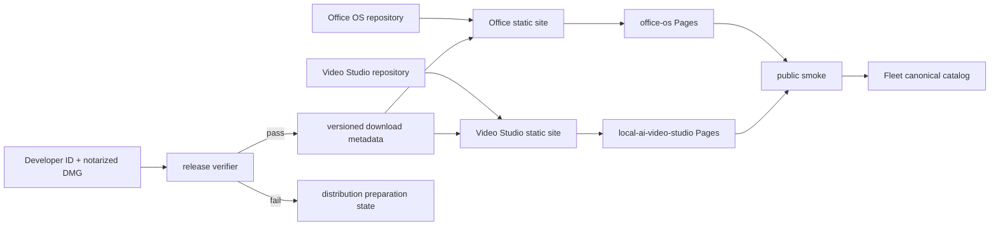

## Context

See `proposal.md` for motivation. Office OS already owns a dependency-free
static landing page under `site/`; Local AI Video Studio has an approved native
visual direction but no web surface. Both repositories build verified arm64
apps and local DMGs, but the installed Keychain currently has no Developer ID
Application identity and no usable notarization profile. Fleet still classifies
both products as local-only and hidden.

## Goals / Non-Goals

**Goals:**

- Establish one repository-owned static product site per Mac application.
- Reuse the native design worlds and real product evidence at browser widths.
- Make unsigned, unnotarized, or stale binaries structurally impossible to link.
- Deploy informational sites independently from trusted binary publication.
- Promote Fleet registry state only from verified live and artifact evidence.

**Non-Goals:**

- Accepting Apple agreements, creating certificates, or handling credentials.
- Shipping an unsigned DMG, creating checkout, or deciding monetization.
- Adding a shared Fleet product hub or a cloud runtime to either native app.
- Renaming Office OS while its product name remains intentionally provisional.

## Decisions

### Use dependency-free static sites in each native repository

Office OS keeps its existing `site/` implementation. Local AI Video Studio adds
a sibling `site/` made from HTML, CSS, JavaScript only when needed, and native
assets. A one-page trust/product surface does not benefit enough from Astro to
justify a new production dependency inside these small Swift packages.

Alternative considered: place both pages in a shared marketing repository. That
would weaken product ownership, couple release timing, and make artifact gating
less inspectable.

### Preserve native visual languages

Office OS uses the existing Editorial Office site as its baseline. Local AI
Video Studio translates Optical Printer Bench into a Persuade surface: media-led
contact sheets, specimen labels, fired-clay probe details, oxidized-teal ready
states, square wells, and restrained technical copy. Both use preserve-mode
design receipts; the owner delegated final judgment with “go for it.”

Alternative considered: invent one shared Fleet marketing template. Rejected
because the products have strong, intentionally different tracked identities.

### Reserve one Pages project per product

The initial project names are `office-os` and `local-ai-video-studio`, yielding
Pages domains that can serve as canonical origins until the owner chooses custom
domains. Deployment is manual through a pinned Wrangler version and explicitly
names the project and `main` branch.

Alternative considered: subpaths on an existing Fleet site. Rejected because it
would obscure ownership and violate the one-project-per-product standard.

### Separate informational deployment from binary release

The static site may deploy with a distribution-preparation state. A generated
release metadata file enables an active download only after a verifier proves
Developer ID authority, notarization, stapling, Gatekeeper acceptance, version,
architecture, filename, and SHA-256. No DMG is copied into the site by the normal
site build.

Alternative considered: publish the current ad-hoc DMGs with a warning. Rejected
because users would receive untrusted artifacts and warnings do not restore
Gatekeeper trust.

### Update Fleet registries after live verification

Catalog state moves in two phases: live informational site first, then
ready-to-share only after support and binary gates. Generated project surfaces
remain downstream of the canonical catalog rather than being edited directly.

## Risks / Trade-offs

- [Pages project names are unavailable at creation time] → Query the authenticated
  account before implementation and use a deterministic product-specific suffix
  only if needed; record the actual canonical origin in every repository.
- [An informational page is mistaken for a shipped download] → Keep the primary
  distribution control disabled and label the current release state explicitly.
- [Release metadata becomes stale] → Generate it only from the verified artifact
  and fail the site check on filename, version, architecture, or checksum drift.
- [Private repositories leak internal detail] → Publish only static build output;
  inspect it for internal paths, draft evidence, credentials, and source links.
- [Pages deployment drifts from `main`] → Record deployment commit evidence and
  run public smoke before changing Fleet catalog state.

## Migration Plan

1. Capture design baselines and create preserve-mode receipts in both products.
2. Verify the existing Office site and build the Video Studio site locally.
3. Add fail-closed release metadata/verifiers and product-local site checks.
4. Create the two Pages projects, deploy informational sites, and run live smoke.
5. Update Fleet canonical configuration and regenerate/check derived catalogs.
6. After Apple credentials become available, produce trusted DMGs, activate
   downloads, repeat smoke, and then consider `readyToBeShared: true`.

Rollback removes the new Pages deployment or restores the previous deployment;
Fleet catalog state remains at its last verified posture. Binary rollback always
removes the active download metadata before withdrawing an artifact.
