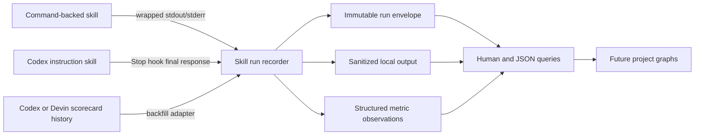

## Context

Fleet skills are instruction packages, not one executable type. Some invoke a
single Fleet Ops command, some orchestrate several local tools, and some exist
only as agent guidance. There is consequently no universal process whose stdout
represents every skill run.

Codex exposes lifecycle hooks with session, turn, transcript-path, working
directory, and final-assistant-message context, but it does not expose a
first-class skill-started or skill-completed event. Devin is invoked through the
Fleet-owned teammate wrapper and scorecard convention. Foundry's tracked
evidence/activity ledger deliberately stores safe provider pointers instead of
raw logs, so it must not become the destination for private skill output.

The existing teammate scorecard is the authoritative historical source for 27
Codex and 7 Devin delegations. It has a curated result note for each invocation
but usually not the original stdout.

## Goals / Non-Goals

**Goals:**

- Create one private machine-local history for Fleet-owned skill executions.
- Retain sanitized output with enough provenance to distinguish exact streams,
  final responses, and reconstructed summaries.
- Store explicit numeric observations in a versioned shape that future
  project-level graphs can query without parsing prose.
- Cover command-backed skills, Codex instruction-only skills, Fleet-mediated
  Devin calls, and the known Codex/Devin scorecard history.
- Fail independently from the skill so an observability error never changes the
  skill's exit status or result.

**Non-Goals:**

- Building project dashboards or choosing a graphing library.
- Inventing numeric values from prose, verdicts, or historical summaries.
- Copying raw skill outputs into git, the Founder Control evidence ledger, or a
  public SaaS Maker surface.
- Parsing every historical Codex transcript or treating the transcript format
  as a stable API.
- Capturing skill runs made outside Fleet's installed hooks/wrappers.

## Decisions

### Store runs in a dedicated private local root

The default root is
`~/Library/Application Support/Fleet Ops/skill-runs/`, consistent with existing
Fleet Ops runtime state. Tests and alternate hosts can override it with
`FLEET_SKILL_RUNS_DIR`.

Each run owns an immutable directory:

```text
skill-runs/
├── index.jsonl
├── metrics.jsonl
└── runs/YYYY/MM/<run-id>/
    ├── run.json
    ├── stdout.log
    ├── stderr.log
    └── output.txt
```

`run.json` is the canonical envelope. The JSONL files are append-only query
indexes that can be rebuilt from run directories. Writes use a temporary file
plus rename, directories and files use owner-only permissions, and a run id or
source idempotency key prevents duplicate ingestion.

SQLite was rejected for version one because append-only files are easier to
inspect, back up, repair, and test, and the expected local volume is small.

### Separate run identity, retained output, and metric observations

A versioned `fleet.skill-run.v1` envelope records:

- run id, skill id/version, project id/root, actor and host;
- source (`wrapped`, `codex-hook`, `devin-wrapper`, or `backfill`);
- capture completeness (`exact-streams`, `final-response`, or `summary-only`);
- started/finished/observed times, duration, status, and exit code;
- output paths, byte counts, hashes, redaction count, and truncation state;
- source reference, correlation id, idempotency key, and reconstruction
  confidence where applicable.

A linked `fleet.skill-metric.v1` observation records:

- run id, project id, skill id, metric name, numeric value, optional unit;
- direction (`higher-is-better`, `lower-is-better`, or `neutral`);
- entity kind/id and optional dimensions;
- observed time and provenance.

Metrics are accepted only through explicit structured input. The recorder never
converts words such as `accepted`, percentages embedded in prose, or scorecard
verdicts into numbers.

### Support three capture paths behind one recorder



The Fleet command exposes:

- `exec --skill <id> --project <id> [--metrics <file>] -- <command...>` to tee
  and retain command streams while preserving the child's exit code;
- `record` for a host or instruction-only skill to persist a completed run and
  output;
- `list`, `show`, `output`, and `metrics` query commands;
- `backfill-teammates` for the checked-in scorecard.

The Codex project hook runs at `Stop`, detects Fleet skill instruction files
read during the turn, and records the final assistant message once for each
detected skill. Because `transcript_path` is convenient but not stable, parsing
is bounded, version-tolerant, and advisory. Failure or ambiguity produces no
fabricated run. Fleet-mediated Devin calls use the command wrapper and therefore
retain the actual command output going forward.

A mandatory receipt block in Fleet-owned skill guidance tells agents to call
`record` when host hooks are unavailable. Coverage remains visible through the
source and capture-completeness fields.

### Sanitize before persistence and make loss visible

Output is streamed through bounded credential-pattern redaction before it is
written. Redacted runs report their redaction count. Per-stream byte limits
prevent runaway storage; truncation retains the head and tail and is explicit
in `run.json`. The recorder rejects metric dimensions with credential-shaped
keys.

The alternative—storing byte-exact raw output and trying to secure it only with
file permissions—was rejected because Fleet skills can call tools whose output
may accidentally contain credentials or private payloads.

### Backfill only curated teammate evidence

`backfill-teammates` parses the checked-in scorecard and creates 34
`summary-only` runs: 27 Codex and 7 Devin. The table note becomes
`output.txt`, the row date becomes the observation date, and repo/scope,
task type, and verdict remain categorical metadata. These runs are marked
`backfilled`, link to the source scorecard path and row fingerprint, and carry
`reconstructionConfidence: curated-summary`.

The importer is idempotent. It does not mine old private prompts or infer
numeric agent scores that were never recorded.

### Keep graph consumption project-scoped and versioned

`metrics --project <id> [--skill <id>] [--metric <name>] --json` returns
chronologically ordered observations with their unit and direction. A project
dashboard can group compatible series but must not combine different units or
directions. Output includes the schema version so later storage migrations do
not silently alter graphs.

## Risks / Trade-offs

- **Codex has no first-class skill lifecycle event** → mark hook-derived runs as
  `final-response`, require explicit receipts as fallback, and expose source so
  coverage is measurable rather than implied.
- **A final response can reflect several skills** → create linked run envelopes
  with the same correlation id and output hash; do not duplicate the output
  bytes when a shared artifact can be referenced safely.
- **Redaction can hide useful text or miss novel secrets** → use bounded,
  tested patterns, report every redaction, keep the store owner-only, and never
  publish it.
- **Append-only indexes can be partially written** → make run directories
  canonical, write atomically, and provide an index rebuild/doctor path.
- **Historical entries have incomplete output** → preserve only the curated
  scorecard note and label completeness/confidence explicitly.
- **Unlimited history consumes disk** → ship a dry-run prune command and size
  reporting, but do not delete automatically in version one.

## Migration Plan

1. Add the recorder library, CLI, schemas, redaction, atomic store, and focused
   tests using a temporary runtime root.
2. Add query and doctor/rebuild behavior.
3. Add the Codex hook adapter, Devin/Fleet command integration, and shared
   receipt guidance.
4. Run the idempotent scorecard backfill and verify exactly 27 Codex plus 7
   Devin reconstructed runs.
5. Run one fixture skill that emits stdout, stderr, and structured metrics;
   verify history, output retrieval, and project-series JSON.
6. Install the repo-owned hook through the existing agent-stack installer after
   trust review.

Rollback disables the hook/wrapper integration while leaving the private run
store intact. No automatic deletion is part of rollback.

## Open Questions

None for version one. Dashboard ownership, cross-machine sync, and whether
metric schemas should later be declared beside each skill remain deferred until
real run history exists.
