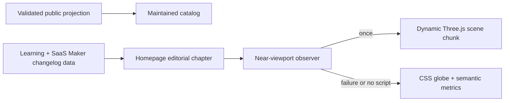

## Context

The released homepage has three relevant boundaries: the generated public
product projection, a product-owned static changelog and learning registry, and
a progressively enhanced Three.js token globe. The established design is a
sunlit steel-and-glass workshop. This is a `preserve` change: it corrects
hierarchy inside that system rather than selecting a new visual direction.

## Goals / Non-Goals

**Goals:**

- Make current public product truth and current SaaS Maker releases easier to find.
- Give the learning article its own editorial rhythm after the catalog.
- Remove Three.js from initial execution while preserving the globe's visual result.
- Keep static content, accessibility, and failure behavior first-class.

**Non-Goals:**

- Publishing internal Fleet timelines or dirty local registry changes.
- Adding a CMS, live feed, carousel, multiple learning cards, or new route.
- Redesigning the catalog rows, past-project archive, hero, navigation, or token accounting.
- Removing Three.js or adding another animation/runtime dependency.

## Decisions

### Treat the canonical projection as the definition of “latest things”

The maintained catalog already passes its generator check. The refresh does not
manufacture new products from local workspace changes. Instead, it records the
recent token-world release in SaaS Maker's own changelog and keeps the homepage
catalog driven by the validated projection.

### Detach learning into one editorial ledger chapter

The catalog becomes one uninterrupted full-width product wall. Immediately
after it, the latest learning becomes a separate steel-framed chapter with a
seeded metadata bay and a cobalt reading bay. This preserves the workshop
materials while removing the “sidebar attached forever” feeling. Only the
latest real article is shown; there is no fake content density.

### Import Three.js at the viewport boundary

The component's static HTML and CSS fallback render normally. A lightweight
IntersectionObserver watches with a bounded positive root margin. On first
approach it dynamically imports a separate scene module, initializes exactly
once, and disconnects the loader observer. The scene module retains capped DPR,
offscreen/visibility pausing, context-loss handling, and disposal. Failed imports
leave the CSS fallback and all semantic content intact.

## Risks / Trade-offs

- **Dynamic import can fail** → leave the immediate CSS globe visible and do
  not affect the counter or measures.
- **The learning chapter can become oversized** → keep one article, concise
  metadata, and a bounded reading measure across 390/768/1440 widths.
- **“Latest” can drift** → derive products from the checked projection and use
  dated, source-controlled changelog/learning entries rather than prose claims.
- **Preloading too early defeats lazy loading** → use a measured viewport margin
  and verify the scene chunk is absent before the boundary and requested once after.

## Migration Plan

1. Capture the current catalog/learning attachment at required widths and create a preserve receipt.
2. Update SaaS Maker's changelog with the shipped token-world release.
3. Separate the catalog and learning markup, then implement the editorial chapter.
4. Move the Three.js scene into a dynamically imported module with resilient fallback behavior.
5. Verify generated public truth, bundle/chunk behavior, browser states, design floors, and owner feedback.
6. Prepare a scoped static release; deployment remains separately authorized.
