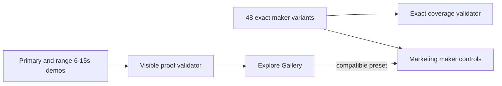

## Context

The production catalog has 48 exact variants across 12 recipes. Exactness matters when an operator creates a video, but it is the wrong unit for a showcase. Palette-only ASCII variants, presenter settings, and continuity levels do not each deserve a separate visible card. The gallery needs to answer “what can this make?” while the maker answers “which exact settings should I use?”

## Goals / Non-Goals

**Goals:**

- Make every visible card a meaningful proof of a video format.
- Preserve complete exact option selection and fail-closed catalog coverage.
- Use longer demonstrations with real motion, narrative progression, or source evidence.
- Keep the gallery fast, honest, and consistent with Fleet Console.
- Put the strongest artifact first and expose materially different engine range without padding the gallery with palette swaps.

**Non-Goals:**

- Remove exact variants from the maker or execution contracts.
- Manufacture proof for an unavailable provider or runtime.
- Show every palette, voice, presenter, or continuity setting as its own gallery card.
- Redesign Fleet Console or add another video product surface.

## Decisions

### Maintain two coverage layers

Reel Pipeline will retain the exact 48-item preset registry as an internal execution and validation layer. Explore Gallery will consume a separate representative-proof registry containing one primary entry per meaningful capability and optional range entries for materially different outputs from the same engine. Every entry points to a compatible exact preset for maker handoff but does not claim to prove every minor option.

Alternative considered: keep 48 cards and improve every clip. This would still make palettes and minor settings look like separate capabilities, create needless media weight, and make comparison harder. Range entries are admitted only when they demonstrate a different motion system, camera move, scene grammar, or model behavior.

### Show engine range without hiding it in montages

Image generation, local video generation, ASCII, and Three.js need more than a single representative card because their range is the product claim. Their proofs will be grouped by capability and shown as individually playable clips instead of compressed into one montage. Each group leads with its strongest clip and labels the material difference: source image treatment, model behavior, ASCII spatial grammar, Three.js scene, or camera move.

The initial range contract is:

- image generation: multiple generated source images animated with push-in, pull-out, lateral pan, and depth/parallax treatments;
- local video generation: the reviewed LTX continuity, object-motion, and transformation clips shown individually;
- ASCII: multiple authored sequences whose geometry and motion differ, not palette-only exports;
- Three.js: multiple live WebGL scenes with orbit, dolly/push, and pull-back camera paths.

Grok remains outside this local range until an operator-approved source artifact exists.

### Require substantive visible proofs

Every visible demo must be 6–15 seconds, vertical, playable, rights-safe, and visibly demonstrate its claimed format. It must use a non-placeholder renderer or an approved source artifact with hashes and evidence. The visible registry rejects `ffmpeg-svg-fixture@1`, `sourcePosture: fixture`, durations below six seconds, and range entries that differ only by palette or copy.

The registry records `proofRole`, `rangeLabel`, and `motionTags`. Validation requires exactly one primary proof for every proven capability, permits a bounded set of range proofs, and calculates capability coverage from unique recipe ids rather than raw card count.

### Review the whole clip, not only the poster

Substantive source posture is necessary but insufficient. A local audit command extracts one frame per second for every visible proof, records media geometry and duration, and produces per-proof contact sheets for human or model review. Reviews score composition, motion progression, temporal coherence, legibility, and usefulness on a five-point scale. Any proof below the showcase bar is repaired, demoted, or excluded; a valid hash and six-second duration cannot override weak visible output.

### Treat missing proof as missing proof

If a capability does not yet have a substantive demo, it is omitted from the proven set and listed in an explicit coverage summary as unproven. A generic fallback never makes the count look complete.

### Keep minor choices in the maker

ASCII palette, voice, presenter, continuity, Blender style, layout, and similar controls remain selectable after the operator enters the maker. Gallery filters group by meaningful format, and one representative card can mention the available option count without duplicating videos.

### Let the work lead and keep comparison controls reachable

Explore Gallery will use the Fleet page heading as its single introduction instead of repeating a second hero and unrelated project scope. Coverage stays compact beside the heading, while the filter rail sits immediately above the first films. On mobile the rail remains below the shell menu rather than competing for the same sticky edge. Once a style is selected for mixing, a persistent bottom tray keeps the selected order and completion action reachable throughout the gallery.

## Risks / Trade-offs

- [Fewer cards may look like less capability] -> Show proven capability count plus exact maker-option count separately.
- [Longer videos increase bytes] -> Use compact H.264 derivatives, lazy loading, and a bounded representative-pack budget.
- [One demo cannot prove every option] -> State that the demo is representative and preserve exact option validation independently.
- [More range clips increase page weight] -> Group by capability, lazy-load media, keep one primary poster visible, and cap each range to the few outputs that materially change the result.
- [Some families may lack real proof initially] -> Report them as unproven and close them only when a real artifact exists.
- [Frame sampling can miss brief animation defects] -> Use one-second sampling as the complete-gallery screen, then play suspicious or high-motion clips end to end before deciding.
- [Persistent controls may cover content] -> Reserve bottom spacing only while the mix tray is active and keep the mobile tray compact.

## Migration Plan

Add and validate the representative registry, build substantive artifacts from approved sources, switch Fleet Console to that registry, and retain the existing exact registry for maker handoff and internal checks. Rollback switches the UI endpoint back without changing maker execution contracts.
