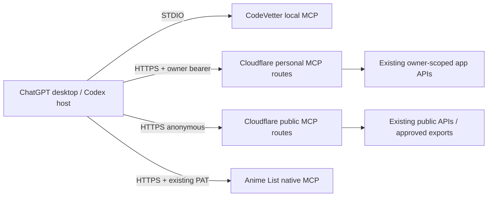

## Context

The completed `expose-fleet-apps-to-chatgpt` implementation provides seven
tested STDIO adapters plus Anime List's native Streamable HTTP MCP. Reader,
Calorie, Setline, and Significant Hobbies have deployed narrow read routes;
Starboard and High Signal have approved public APIs; Research Papers has a
local FastAPI corpus and approved public exports.

CodeVetter independently ships an installed, read-only STDIO sidecar. It opens
its local SQLite database in query-only mode and requires per-repository
indexing plus explicit enablement in CodeVetter. On this host, only
`knowledge-base` is indexed and zero MCP repository scopes are enabled.

ChatGPT desktop, Codex CLI, and the IDE share local MCP configuration. ChatGPT
web does not read that local configuration. Streamable HTTP endpoints can be
used by the local clients and can later be registered as developer-mode apps;
web/plugin account authentication beyond the existing bearer-token contract is
not added by this change.

## Goals / Non-Goals

**Goals:**

- Make the existing CodeVetter sidecar usable directly on its local host while
  preserving CodeVetter's consent and revocation controls.
- Give existing cloud-backed adapters one always-available Cloudflare
  Streamable HTTP transport without duplicating their domain logic.
- Keep personal credentials request-scoped and app-owned.
- Preserve independent product identities, tool catalogs, and rollback.
- Produce honest per-connection readiness and evaluation evidence.

**Non-Goals:**

- Cloud sync or accounts for Indulge or any other device-only product.
- Significant Hobbies private records or Research Papers full-corpus cloud
  hosting.
- OAuth, public plugin submission, mutation tools, UI resources, or a general
  HTTP proxy.
- Changing CodeVetter's sidecar, indexing model, repository scopes, or local
  database.
- Requiring Secure MCP Tunnel for sources already reachable locally or over
  approved HTTPS.

## Decisions

### 1. Use three transport lanes selected by source ownership

The source boundary determines transport. This avoids an always-on local host
for cloud data while keeping local-only evidence off the network. Blanket
tunnels were rejected because they add control-plane credentials and host
availability to sources that are already safely reachable over HTTPS.

### 2. Keep CodeVetter's app-owned consent flow authoritative

CodeVetter remains a direct STDIO configuration using the exact command,
database path, and opaque repository ID generated by **Settings → Agent MCP**.
Automation may inspect readiness and add an already-enabled generated config,
but it must not insert scopes or enable repositories directly in SQLite.

This preserves live revocation and prevents a Fleet helper from creating a
parallel interpretation of CodeVetter access. A global CodeVetter data server
was rejected because the existing sidecar is intentionally repository-scoped.

### 3. Use one stateless Cloudflare Worker with product-scoped MCP routes

The shared helper gains a web-standard Streamable HTTP entrypoint and a fixed
registry of product routes such as `/reader/mcp`, `/calorie/mcp`, and
`/starboard/mcp`. Initialization at one route advertises only that product.
Tool calls reuse the existing schemas, allowlisted operations, normalization,
timeouts, retries, and sanitization.

A shared deployment reuses the implementation already validated across seven
adapters and avoids adding MCP dependencies to every product. Product-scoped
routes preserve independent client configuration and can be disabled in the
registry. Separate per-product Workers were rejected for phase one because
they multiply deployment/config drift without improving the underlying
app-owned auth boundary.

Anime List bypasses this Worker because its native endpoint already owns the
protocol, schemas, and PAT resolution.

### 4. Forward personal bearer credentials per request and never store them

For a personal route, the Worker reads the request's Authorization bearer,
validates only the expected product prefix, and passes it to the existing
app-specific read client for that request. No credential is placed in global
state, a Worker secret, logs, Durable Objects, KV, D1, cache keys, or responses.

This makes the owning application's token table the only owner identity and
revocation authority. Embedding the operator's tokens as Worker secrets was
rejected because any caller reaching the route could otherwise invoke the
operator identity unless a second authentication system were added.

### 5. Public routes carry no credential and use only approved sources

Starboard, High Signal, Significant Hobbies public data, and Research Papers
public exports use the existing anonymous allowlists. The hosted Research
Papers route advertises only export-backed operations; local corpus search,
detail, and similarity remain available solely through the existing local
adapter when its FastAPI service runs.

The Worker may emit conservative cache headers for successful anonymous
responses, but personal responses and protocol messages are never cached.

### 6. Keep local STDIO behavior while adding web-standard transport

The shared tool definitions and handlers become transport-independent. STDIO
entrypoints remain for local diagnosis and rollback; the Worker constructs a
fresh request-scoped server/transport boundary for HTTPS calls. No request may
reuse another request's authorization or session state.

Cloudflare compatibility and dependency decisions must be proven before
manifest changes. Prefer the already-installed MCP SDK's web-standard
transport when it supports the Workers runtime; otherwise use the smallest
official Cloudflare MCP runtime justified by a `code-cleanup` dependency gate.

### 7. Activation proceeds from protocol proof to production registration

Each route passes fixture tests, mutation-absence tests, Worker-local HTTP MCP
initialize/list/call checks, and an authenticated or anonymous production
status-only probe. Connections are then added one at a time to ChatGPT desktop;
developer-mode web registration is attempted only where current account and
authentication support allow it.

## Risks / Trade-offs

- **Shared Worker outage affects several hosted connections** → Keep routes
  stateless, preserve STDIO rollback, use per-route health evidence, and avoid
  shared credentials or storage.
- **Bearer tokens traverse an internet-facing endpoint** → Require HTTPS,
  never log/cache/persist authorization, retain app-owned hashing/revocation,
  and bound Cloudflare observability fields.
- **Static bearer authentication may not satisfy every ChatGPT web policy** →
  Qualify ChatGPT desktop first and report web registration separately; OAuth
  is a future explicit change.
- **Research Papers hosted capability is smaller than its local adapter** →
  Advertise only export-backed tools and label retrieval mode/freshness rather
  than simulating full corpus availability.
- **Setline has no current owner row** → Deploying protocol transport does not
  fabricate an account; activation remains pending a real sign-in.
- **CodeVetter has no enabled repository scope** → Require the existing in-app
  enable action and never bypass its local consent table.

## Migration Plan

1. Record the new change and tracking issue without modifying the completed
   tunnel-era implementation artifacts.
2. Verify CodeVetter's installed sidecar, indexed repositories, and generated
   configuration; wait for explicit in-app enablement where required.
3. Prove Anime List's native production MCP with anonymous catalog and
   dedicated-owner calls.
4. Run the dependency/Workers compatibility gate, then add the shared
   Streamable HTTP transport and fixed product route registry.
5. Test public routes, personal credential isolation, response bounds,
   mutation absence, and secret-safe logs locally.
6. Deploy the shared Worker through the manual Cloudflare path with exact Git
   SHA tagging, then run status-only production MCP probes.
7. Add connections to ChatGPT desktop one at a time and execute the retained
   positive, negative, cross-app, privacy, and mutation evaluations.

Rollback removes or disables the affected client connection and rolls the
shared Worker back through Cloudflare's version controls. App-owned credentials
can be revoked independently. CodeVetter rollback removes its client entry and
uses CodeVetter's existing Disable action; no local repository or user data is
deleted.
