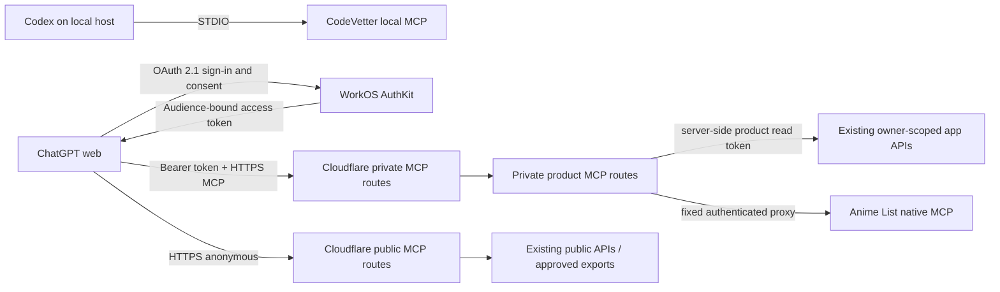

## Context

The completed `expose-fleet-apps-to-chatgpt` implementation provides seven
tested STDIO adapters plus Anime List's native Streamable HTTP MCP. Reader,
Calorie, Setline, and Significant Hobbies have deployed narrow read routes;
Starboard and High Signal have approved public APIs; Research Papers has a
local FastAPI corpus and approved public exports.

CodeVetter independently ships an installed, read-only STDIO sidecar. It opens
its local SQLite database in query-only mode and requires per-repository
indexing plus explicit enablement in CodeVetter. On this host, only
`knowledge-base` is known to the graph in `partial` state and zero MCP
repository scopes are enabled.

The confirmed product boundary is explicit: local-only MCP servers are for
Codex, while every hosted MCP connection is for ChatGPT web. ChatGPT web cannot
present product PATs or custom API keys. Customer-specific MCP tools therefore
need OAuth 2.1 with protected-resource metadata, OAuth discovery, PKCE, scoped
tokens, and refresh/revocation behavior.

## Goals / Non-Goals

**Goals:**

- Make the existing CodeVetter sidecar usable directly on its local host while
  preserving CodeVetter's consent and revocation controls.
- Give existing cloud-backed adapters one always-available Cloudflare
  Streamable HTTP transport without duplicating their domain logic.
- Make every hosted route usable from ChatGPT web, with public tools anonymous
  and private tools protected by owner-only MCP OAuth.
- Keep application credentials server-side, product-scoped, and app-owned.
- Preserve independent product identities, tool catalogs, and rollback.
- Produce honest per-connection readiness and evaluation evidence.

**Non-Goals:**

- Cloud sync or accounts for Indulge or any other device-only product.
- Significant Hobbies private records or Research Papers full-corpus cloud
  hosting.
- General multi-user product linking, public ChatGPT directory submission,
  mutation tools, UI resources, or a general HTTP proxy.
- Changing CodeVetter's sidecar, indexing model, repository scopes, or local
  database.
- Requiring Secure MCP Tunnel for sources already reachable locally or over
  approved HTTPS.

## Decisions

### 1. Use three transport lanes selected by source ownership

The source boundary determines transport. This avoids an always-on local host
for cloud data while keeping local-only evidence off the network. Blanket
tunnels were rejected because they add control-plane credentials and host
availability to sources that are already safely reachable over HTTPS.

### 2. Keep CodeVetter's app-owned consent flow authoritative

CodeVetter remains a Codex-only STDIO configuration using the exact command,
database path, and opaque repository ID generated by **Settings → Agent MCP**.
Automation may inspect readiness and add an already-enabled generated config,
but it must not insert scopes or enable repositories directly in SQLite.

This preserves live revocation and prevents a Fleet helper from creating a
parallel interpretation of CodeVetter access. A global CodeVetter data server
was rejected because the existing sidecar is intentionally repository-scoped.

### 3. Use one Cloudflare connection surface with product-scoped MCP routes

The shared helper gains a web-standard Streamable HTTP entrypoint and a fixed
registry of product routes such as `/reader/mcp`, `/calorie/mcp`, and
`/starboard/mcp`. Initialization at one route advertises only that product.
Tool calls reuse the existing schemas, allowlisted operations, normalization,
timeouts, retries, and sanitization.

A shared deployment reuses the implementation already validated across seven
adapters and avoids adding MCP dependencies to every product. Product-scoped
routes preserve independent ChatGPT app configuration and can be disabled in
the registry. Public MCP handling remains stateless and request-scoped. WorkOS
owns OAuth client registration, authorization state, consent, access tokens,
refresh tokens, and revocation; private tool execution in the Worker remains
request-scoped.

Anime List keeps its native endpoint as the fixed upstream implementation. The
gateway authorizes ChatGPT, injects the dedicated Anime PAT from a Worker
secret, and proxies only the native MCP route. It does not become a general HTTP
proxy and does not duplicate Anime's tools.

### 4. Protect private hosted tools with WorkOS AuthKit-backed MCP OAuth

WorkOS AuthKit is the OAuth authorization server and the Cloudflare Worker is
the MCP resource server. WorkOS Connect provides authorization-server metadata,
authorization-code + PKCE, Client ID Metadata Document support, Dynamic Client
Registration compatibility, consent, `offline_access` refresh tokens, and
revocation. Fleet uses the hosted `*.authkit.app` domain and does not enable a
custom domain, enterprise SSO, Directory Sync, Cross App Access, or another
paid add-on.

Every private MCP route is registered as an exact WorkOS Resource Indicator.
The Worker publishes protected-resource metadata naming the WorkOS issuer and
uses the WorkOS JWKS to validate each bearer JWT's signature, issuer, exact
route audience, expiry, allowlisted WorkOS user ID in `sub`, and required
product-read permission or scope before invoking a tool. Email is not an
authorization key. ChatGPT requests `offline_access` so the connection can
refresh without a daily owner sign-in.

Existing Reader, Calorie, Setline, and Anime List read credentials live only as
product-specific Worker secrets. After OAuth authorization, the Worker injects
the matching credential into that request's fixed upstream call. It never puts
an application PAT into ChatGPT, OAuth tokens, logs, cookies, cache keys,
responses, or another product route.

WorkOS may persist only the user identity and OAuth state, registered client
metadata, consent, grants, and token material required by AuthKit and Connect.
It is not a Fleet data warehouse or general application account database.
General multi-user application linking is deferred; an identity other than the
allowlisted WorkOS owner user ID fails closed.

Direct product-PAT authentication from ChatGPT was rejected because OpenAI's
hosted client cannot present custom API keys. The custom Cloudflare
Access-to-OAuth bridge and Worker-owned OAuth token store are superseded because
WorkOS provides the protocol edge cases, client registration, refresh-token
handling, consent, and revocation as a managed authorization server.

### 5. Public routes carry no credential and use only approved sources

Starboard, High Signal, Significant Hobbies public data, and Research Papers
public exports use the existing anonymous allowlists. The hosted Research
Papers route advertises only export-backed operations; local corpus search,
detail, and similarity remain available solely through the existing local
adapter when its FastAPI service runs.

The Worker may emit conservative cache headers for successful anonymous
responses, but personal responses and protocol messages are never cached.

### 6. Keep local STDIO behavior while adding ChatGPT web transport

The shared tool definitions and handlers become transport-independent. STDIO
entrypoints remain for local diagnosis and rollback, but only CodeVetter is
registered in Codex. The Worker constructs a fresh request-scoped
server/transport boundary for HTTPS tool calls. No request may reuse another
request's authorization, upstream credential, or result state.

Cloudflare compatibility and dependency decisions must be proven before
manifest changes. Prefer standards-based Web Crypto/JWKS verification and the
already-installed MCP SDK's web-standard transport when they support the
Workers runtime; otherwise use the smallest justified runtime dependency after
a `code-cleanup` dependency gate and explicit approval.

### 7. Activation proceeds from protocol proof to production registration

Each route passes fixture tests, mutation-absence tests, Worker-local HTTP MCP
initialize/list/call checks, and an OAuth-authenticated or anonymous production
status-only probe. Hosted connections are then added one at a time as ChatGPT
web developer-mode apps. CodeVetter is separately added to Codex only after its
existing in-app repository consent is enabled.

A credential-free activation verifier checks the public WorkOS discovery and
JWKS contract before deployment and the gateway discovery plus exact protected
resource documents afterward. It must report owner allowlisting, WorkOS
Resource Indicator registration, paid-feature settings, authorization-code
exchange, refresh rotation, and revocation as separate manual/live gates because
none is proven by public metadata alone.

## Risks / Trade-offs

- **Shared Worker outage affects several hosted connections** → Keep tool
  execution stateless, preserve STDIO diagnostic rollback, use per-route health
  evidence, and make product scopes/credentials independently revocable.
- **WorkOS grants and product tokens become security-critical state** → Use
  WorkOS's hosted authorization server for PKCE, consent, short-lived access
  tokens, refresh-token rotation, and revocation; validate JWKS, issuer, exact
  audience, expiry, owner `sub`, and permission at the Worker; retain only
  product credentials in matching Cloudflare secret bindings.
- **A future WorkOS setting could create spend** → Production activation
  requires a written cost check: AuthKit below one million monthly active users,
  hosted WorkOS domain, and no SSO, Directory Sync, custom domain, Cross App
  Access, or other paid feature. Billing information may be present only because
  WorkOS requires it to unlock production; any non-zero charge blocks
  activation and requires new owner approval.
- **A compromised OAuth route could reach owner data** → Verify issuer,
  resource/audience, scope, expiry, and owner identity on every private request;
  bind each route to one upstream token and never accept caller-controlled
  origins, URLs, headers, or credentials.
- **Research Papers hosted capability is smaller than its local adapter** →
  Advertise only export-backed tools and label retrieval mode/freshness rather
  than simulating full corpus availability.
- **Setline has no current owner row** → Deploying protocol transport does not
  fabricate an account; activation remains pending a real sign-in.
- **CodeVetter has no enabled repository scope** → Require the existing in-app
  enable action and never bypass its local consent table.

## Migration Plan

1. Record the new change and tracking issue without modifying the completed
   tunnel-era implementation artifacts.
2. Verify CodeVetter's installed sidecar, indexed repositories, and generated
   configuration; wait for explicit in-app enablement where required.
3. Prove Anime List's native production MCP with anonymous catalog and
   dedicated-owner calls, then keep the PAT out of all local client config.
4. Run the dependency/Workers compatibility gate, add the shared Streamable
   HTTP transport and fixed product route registry, and preserve public routes
   as anonymous.
5. Replace the custom Cloudflare Access OAuth bridge with WorkOS AuthKit:
   publish protected-resource metadata, proxy legacy authorization-server
   discovery only where client compatibility requires it, register exact route
   Resource Indicators, validate WorkOS JWTs and owner identity, require product
   read permissions plus `offline_access`, and keep product credentials in
   server-side Cloudflare bindings.
6. Test OAuth discovery/linking, owner allowlisting, public routes, private
   credential isolation, response bounds, mutation absence, and secret-safe
   logs locally.
7. Deploy through the manual Cloudflare path with exact Git SHA tagging, run
   status-only production probes, then create one ChatGPT web developer-mode
   app per ready hosted product and execute the retained evaluations.

Rollback disables the affected ChatGPT app or WorkOS grant and rolls the shared
Worker back through Cloudflare's version controls. App-owned credentials and
WorkOS grants can be revoked independently. CodeVetter rollback removes its
Codex entry and uses CodeVetter's existing Disable action; no local repository
or user data is deleted.
